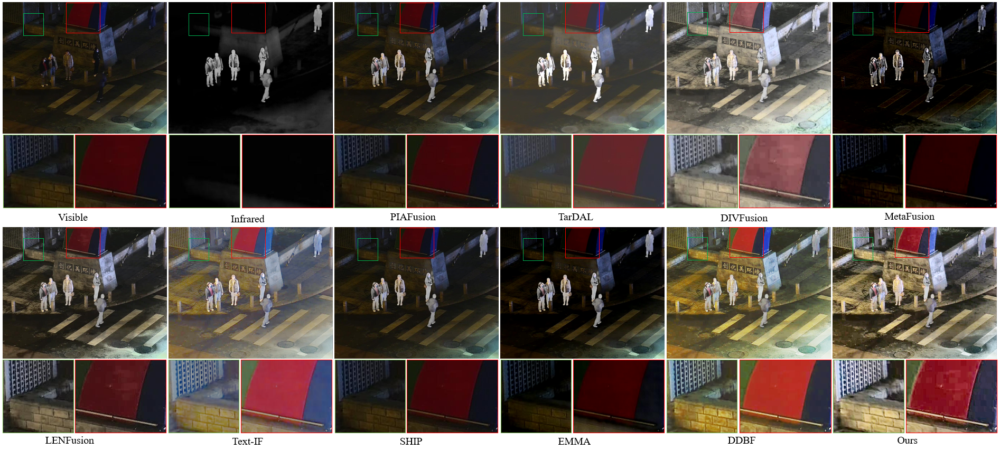
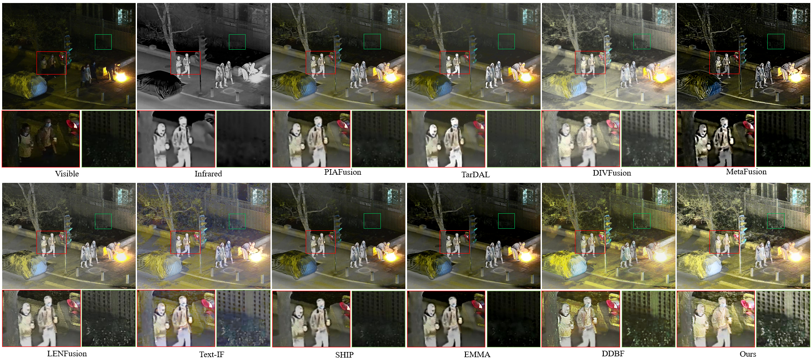

# ILEFuse

The code will be released soon.

# Abstract

Multi-modal image fusion struggles to produce high-quality results under suboptimal illumination. The existing fusion methods merely treat low-light enhancement as a data augmentation "stepping stone", failing to effectively combine the characteristics of low-light enhancement with multimodal fusion, resulting in limited fusion performance under extreme lighting conditions. To overcome these limitations, this paper proposes a coupled learning framework, called ILEFuse, to break the performance bottleneck of infrared and visible image fusion and low-light enhancement. It provides an illumination-appropriate condition for multimodal image fusion through interaction-driven low-light enhancement.  Specifically, the proposed shared illumination enhancement network focuses on exploring illumination factors in low-light visible modalities. Subsequently, the scene recovery network leverages the enhanced results from shared illumination enhancement network and integrates them with the advantageous features of infrared images. This one-pass imaging process improves visibility and color expression in low-light environments while ensuring efficient multimodal data integration.  Benefiting from an illumination-color estimator, the fusion priors feed back into the enhancement process, compelling shared illumination enhancement network to generate enhanced results with significant contrast and vivid colors.  Extensive experiments demonstrate that our IFFuse not only produces outstanding fusion results but also enhances high-level visual tasks.

# Experiments

